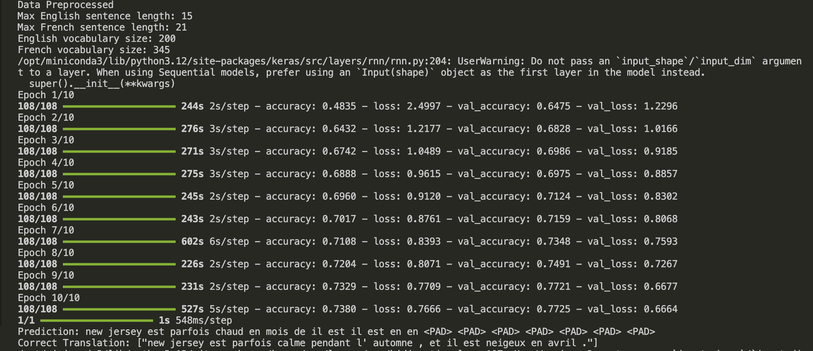

# Englisht_to_French

### 1. `data_loader.py`
This file handles the loading and preprocessing of data for your machine learning model. It typically includes functions to:
- **Load Data**: Reads text data from files or other sources into Python data structures (like lists or arrays).
- **Tokenization**: Converts text data into numerical sequences (tokens) suitable for input into neural networks. This involves mapping words or characters to numerical indices.
- **Padding**: Ensures that all sequences are of uniform length by adding zeros or other markers to shorter sequences.

### 2. `model_builder.py`
In this file, you define functions to construct different variations of your neural network models. These functions create the model architectures using libraries like Keras or TensorFlow. Each function typically:
- **Defines Layers**: Specifies the architecture of the neural network, including types of layers (e.g., LSTM, GRU, Dense), activation functions, and dropout layers.
- **Compiles the Model**: Sets up the loss function, optimizer, and evaluation metrics for training.
- **Returns the Model**: Provides the constructed model object ready for training or evaluation.

### 3. `model_training.py`
This file handles the actual training of your neural network models. It includes functions to:
- **Train the Model**: Takes input data (sequences) and labels, and fits the model to learn from this data.
- **Monitor Training**: Optionally includes code to track metrics like loss and accuracy during training.
- **Save Models**: After training, saves the trained model weights to disk for future use.

### 4. `model_evaluation.py`
Here, you evaluate the performance of your trained models using metrics appropriate for your task. This file typically:
- **Loads Trained Models**: Loads previously saved model weights from disk.
- **Performs Inference**: Uses the trained models to generate predictions on new data.
- **Evaluates Predictions**: Compares model predictions with ground truth labels to compute metrics such as accuracy, precision, recall, or more specific metrics relevant to your application domain.

### 5. `main.py`
This script serves as the orchestrator that ties everything together:
- **Loads Data**: Calls functions from `data_loader.py` to load and preprocess data.
- **Builds Models**: Utilizes functions from `model_builder.py` to construct different types of neural network models.
- **Trains Models**: Invokes functions from `model_training.py` to train each model on the prepared data.
- **Evaluates Models**: Uses functions from `model_evaluation.py` to assess the performance of trained models.
- **Saves Results**: Optionally saves the trained models, evaluation results, or other outputs for future reference or deployment.

By organizing your project into these files, each with a specific responsibility, you create a modular and maintainable machine learning pipeline. This structure allows you to easily modify components, swap models, and scale your project as needed.

### Output
